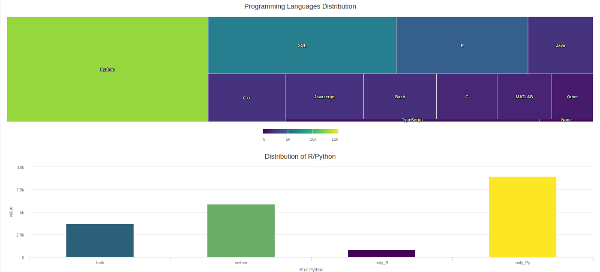

# Python Tools for Data Science, Machine Learning and Scientific computing - 2020

Python is a general purpose programming languague that has become the leader in the [scientific computing and data science landscape](https://towardsdatascience.com/kaggle-user-survey-2019-326e187ff207).


Source: Kaggle Survey 2019

Python success has been driven primarily because of its **intuitive syntaxis**, **flexibility**, and **extensivility**, meaning that it's easy to learn, it can be used for a wide variety of taks, and incorporating numerical computing libraries written in high-performance languages like C++ and Fortran is straightforward. Additionally, Python benefits from a large and strong community of developers commited to free and open source software.  

Python libraries for Scientific Computing and Data Science are **extensive**, **secure**, and **mature**. Companies like Google, Microsoft, Apple, Dropbox, and Netflix, use Python for several critical applications, in particular the ones based on data processing and machine learning. Companies like Instagram and Youtube were built from the ground up in Python.

In academia, Python is the facto standard for research and applications in artificial intelligence (AI), machine learning (ML), and big data analysis. All the major frameworks for AI and ML, i.e., [Tensorflow](https://www.tensorflow.org/), [Keras](https://keras.io/), [PyTorch](https://pytorch.org/), and [MXNet](https://mxnet.apache.org/), are based on Python.

Python also has a continiously growing an strong presence in the Data Visualization field, with libraries like [Matplotlib](https://matplotlib.org/), [Seaborn](https://seaborn.pydata.org/), [Altair](https://altair-viz.github.io/), and [Plotly](https://plotly.com/).

Python presence in statistics is weaker and less mature than the one of languages like R, STATA, and SPSS. Libraries like [Statsmodels](https://www.statsmodels.org/stable/index.html) and [PyMC3](https://docs.pymc.io/) are in constant development and helping too close the gap between Python and other frameworks. This is not to say that you cannot do statistics in Python. As a matter of fact, you can do absolutely everything that can be done in other languages, but it may requiere more effort or more advance knowledge of Python.

The two pillars of Scientific Computing and Data Science in Python are **[NumPy](https://numpy.org/)** and **[Pandas](https://pandas.pydata.org/)**. NumPy is a library for numerical computing, particularly matrix-like computation. Pandas is a library for data analysis and data frame manipulation. NumPy and Pandas are commonly used in tandem as the base for any kind of data processing and modeling.  

In this project, I focus in the fundamentals of **NumPy** and **Pandas** for Data Science, Machine Learning, and Scientific Computing in Python. I will also plan to introduce the UNIX shell and Python basics such that you can use NumPy and Pandas effectively.

If you want to acquire the math fundamentals before approaching Python and its libraries, I am working in a another project which covers that ([here](https://github.com/pabloinsente/math-app-ml)). The Linear Algebra chapters is the most important and can be found [here](https://pabloinsente.github.io/intro-linear-algebra).

## Table of contents

I'll cover the following topics:

0. Introduction to the UNIX shell and Bash
1. Introduction to Jupyter Notebooks: set-up, user-guide, and best practices  
2. Introduction to Python basics
3. Introduction to NumPy   
4. Introduction to Pandas

The content of each section will be delivered as a Jupyter Notebook and/or Markdown files.

## Usage

There are two alternatives to access the contents: **remote** and **local**.

The **remote option** does not require any installation or configuration from your part. It is click and play. But, you will have a lot less control over the Python set up, you will probably have to use a slow machine in the cloud, and you won't be able to save and recover anything you change in the Notebooks (you will  have to download the Notebooks with the changes). Since this is a begginer workshop, I highly recommend to use this option, as performance and control are not issues at this point.

The **local option** does require to follow a series of instructions to download and set up everything in your computer. I do provide the code to copy-paste and run in the terminal, but such instructions only work for Linux-based systems, like Macbooks are Linux-machines. If you are a Windows users, you have two options:

1. downloading and installing terminal emulators like [GitBash](https://gitforwindows.org/) and [Cygwin](https://www.cygwin.com/)
2. to install the [Windows Subsystem for Linux (WSL)](https://docs.microsoft.com/en-us/windows/wsl/install-win10).

If you are a beginner, [GitBash](https://gitforwindows.org/) and [Cygwin](https://www.cygwin.com/) should work just fine. I do not advise trying (WSL) unless you feel comfortable with using the terminal.

### Option 1: Cloud-based environment (prefered)

Click in the ```binder``` icon -> [](https://mybinder.org/v2/gh/pabloinsente/intro-sc-python/master/?urlpath=lab)

This will build an online development environment with the repository contents. Beware that it may take 2-3 minutes to be ready.

Then navigate to the `notebooks` directory and click on `TURORIAL-NAME.ipynb`

### Option 2: Local environment

To obtain the files locally, run this in the command line:

```git
git clone https://github.com/pabloinsente/intro-sc-python.git
```

To set up your system, you need Python 3.6 installed in a Linux/Mac machine. Check you have Python installed by running this in the terminal:

```bash
python3 --version
```

you should see something like

```bash
python 3.6.X # the X stands for any number
```

If you do not have Python 3.6 installed, go to the [Python website](https://www.python.org/downloads/), search Python 3.6.8 under the "Looking for a specific release?" section, and follow the downloading and installing instructions.

Once you have Python installed, It is recommended to use a [virtual environment](https://docs.python.org/3/tutorial/venv.html) before installing the dependencies. To do this, navigate into the cloned repository in the console by:

```bash
cd intro-sc-python
```

Note that you may need to change the path to `cd` into the directory.  

Then run this inside that directory to create the virtual environment:

```Python
python3 -m venv venv
```

And activate your environment by running:

```bash
source venv/bin/activate
```

Make sure to have the latest pip version:

```bash
pip install --upgrade pip
```

Install dependencies by running:

```Python
pip install -r requirements.txt
```

**To run the notebook**, navigate to the ```notebooks``` directory and launch Jupyter Lab as:

```Python
jupyter lab ./notebooks/TURORIAL-NAME.ipynb
```
